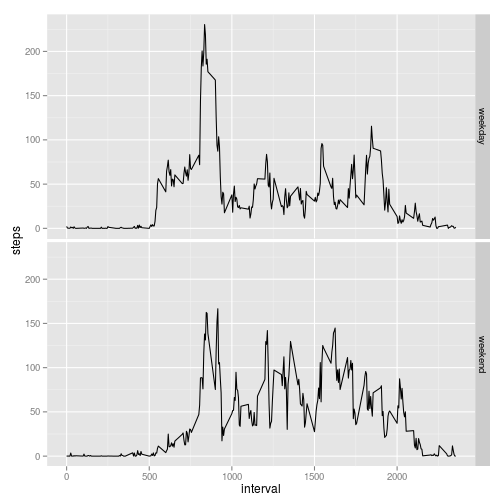

## Loading and preprocessing the data

> Show any code that is needed to load the data (i.e. `read.csv()`)

First, we need to load the data that is in the same folder as this script.   
Since it is a zip file, let us unzip and check its contents:


```r
file.name <- "activity.zip"
unziped.file <- unzip(file.name)
data <- read.csv(unziped.file)
head(data, 15)
```

```
##    steps       date interval
## 1     NA 2012-10-01        0
## 2     NA 2012-10-01        5
## 3     NA 2012-10-01       10
## 4     NA 2012-10-01       15
## 5     NA 2012-10-01       20
## 6     NA 2012-10-01       25
## 7     NA 2012-10-01       30
## 8     NA 2012-10-01       35
## 9     NA 2012-10-01       40
## 10    NA 2012-10-01       45
## 11    NA 2012-10-01       50
## 12    NA 2012-10-01       55
## 13    NA 2012-10-01      100
## 14    NA 2012-10-01      105
## 15    NA 2012-10-01      110
```

> Process/transform the data (if necessary) into a format suitable for your analysis

Now, we can transform the date into a POSIX format.


```r
data <- transform(data, date = as.POSIXct(date, format="%Y-%m-%d"))
head(data)
```

```
##   steps       date interval
## 1    NA 2012-10-01        0
## 2    NA 2012-10-01        5
## 3    NA 2012-10-01       10
## 4    NA 2012-10-01       15
## 5    NA 2012-10-01       20
## 6    NA 2012-10-01       25
```

## What is mean total number of steps taken per day?

> For this part of the assignment, you can ignore the missing values in the dataset. 

> - Make a histogram of the total number of steps taken each day

To group the values, we can use tapply to sum all the steps in a day.   
As we want to avoid NAs, we will use the argument `na.rm = TRUE` in the function `sum`.   


```r
total.sum.per.day <- tapply(data$steps, data$date, sum, na.rm = TRUE)
```

> - Make a histogram of the total number of steps taken each day


```r
plot(as.Date(rownames(total.sum.per.day)), total.sum.per.day, type="h", xlab = "Date", ylab = "Number of steps")
```

 

> - Calculate and report the **mean** and **median** total number of steps taken per day


```r
mean(total.sum.per.day)
```

```
## [1] 9354.23
```

```r
median(total.sum.per.day)
```

```
## [1] 10395
```

## What is the average daily activity pattern?

> - Make a time series plot (i.e. `type = "l"`) of the 5-minute interval (x-axis) and the average number of steps taken, averaged across all days (y-axis).


```r
total.mean.per.interval <- tapply(data$steps, data$interval, mean, na.rm = TRUE)
plot(rownames(total.mean.per.interval), total.mean.per.interval, type="l", xlab = "5-minute interval", ylab = "Mean of steps")
```

 

> - Which 5-minute interval, on average across all the days in the dataset, contains the maximum number of steps?

The answer is in the row name of the position with the highest value.


```r
rownames(total.mean.per.interval)[total.mean.per.interval == max(total.mean.per.interval)]
```

```
## [1] "835"
```

## Imputing missing values

> Note that there are a number of days/intervals where there are missing values (coded as NA). The presence of missing days may introduce bias into some calculations or summaries of the data.   
Calculate and report the total number of missing values in the dataset (i.e. the total number of rows with NAs)

First, we check whether there are NAs in the columns **date** and **interval** too:

```r
colSums(sapply(data, is.na))
```

```
##    steps     date interval 
##     2304        0        0
```

The answer is **no**. Therefore, we can assume that the total number of NAs is the sum in the first column only.

To do that, we need to sum up the values which are NA.


```r
sum.nas <- sum(is.na(data$steps))
print(sum.nas)
```

```
## [1] 2304
```

> Devise a strategy for filling in all of the missing values in the dataset. The strategy does not need to be sophisticated. For example, you could use the mean/median for that day, or the mean for that 5-minute interval, etc.   
Create a new dataset that is equal to the original dataset but with the missing data filled in.

The strategy will be to fill the `NA` with the respective mean for that 5-minute interval.


```r
# copy of the data
data.filled <- data

data.filled$steps <- mapply(function(steps, interval){
        # if it is NA
        if(is.na(steps)){
                # get the mean from the calculations done earliner
                total.mean.per.interval[rownames(total.mean.per.interval) == interval]
        }else{
                # otherwise, keep the original value
                steps
        }
}, data$steps, data$interval)

head(data.filled, 15)
```

```
##        steps       date interval
## 1  1.7169811 2012-10-01        0
## 2  0.3396226 2012-10-01        5
## 3  0.1320755 2012-10-01       10
## 4  0.1509434 2012-10-01       15
## 5  0.0754717 2012-10-01       20
## 6  2.0943396 2012-10-01       25
## 7  0.5283019 2012-10-01       30
## 8  0.8679245 2012-10-01       35
## 9  0.0000000 2012-10-01       40
## 10 1.4716981 2012-10-01       45
## 11 0.3018868 2012-10-01       50
## 12 0.1320755 2012-10-01       55
## 13 0.3207547 2012-10-01      100
## 14 0.6792453 2012-10-01      105
## 15 0.1509434 2012-10-01      110
```

> Make a histogram of the total number of steps taken each day


```r
new.sum.per.day <- tapply(data.filled$steps, data.filled$date, sum)
plot(as.Date(rownames(new.sum.per.day)), new.sum.per.day, type="h", xlab = "Date", ylab = "Number of steps")
```

 

> Calculate and report the mean and median total number of steps taken per day.  


```r
mean(new.sum.per.day)
```

```
## [1] 10766.19
```

```r
median(new.sum.per.day)
```

```
## [1] 10766.19
```

> Do these values differ from the estimates from the first part of the assignment?

The original values were:


```r
mean(total.sum.per.day)
```

```
## [1] 9354.23
```

```r
median(total.sum.per.day)
```

```
## [1] 10395
```

Yes, they differ.

> What is the impact of imputing missing data on the estimates of the total daily number of steps?

The new values made the mean and the median increase. More interestingly, the number of imputted values was so high that the mean and the median became the same.

## Are there differences in activity patterns between weekdays and weekends?

> For this part the `weekdays()` function may be of some help here. Use the dataset with the filled-in missing values for this part.   
Create a new factor variable in the dataset with two levels – “weekday” and “weekend” indicating whether a given date is a weekday or weekend day.


```r
data.filled$weekday <- "weekday"
data.filled$weekday[weekdays(data.filled$date) %in% c("Sunday", "Saturday")] <- "weekend"
data.filled <- transform(data.filled, weekday = factor(weekday))
# checking the factor:
print(levels(data.filled$weekday))
```

```
## [1] "weekday" "weekend"
```

```r
# new data frame:
head(data.filled)
```

```
##       steps       date interval weekday
## 1 1.7169811 2012-10-01        0 weekday
## 2 0.3396226 2012-10-01        5 weekday
## 3 0.1320755 2012-10-01       10 weekday
## 4 0.1509434 2012-10-01       15 weekday
## 5 0.0754717 2012-10-01       20 weekday
## 6 2.0943396 2012-10-01       25 weekday
```

> Make a panel plot containing a time series plot (i.e. type = "l") of the 5-minute interval (x-axis) and the average number of steps taken, averaged across all weekday days or weekend days (y-axis). See the README file in the GitHub repository to see an example of what this plot should look like using simulated data.


```r
library(ggplot2)
p <- qplot(interval, steps, data = data.filled, facets=weekday~.) + stat_summary(fun.y=mean, geom="line")
#removing the points
p$layers[1] <- NULL
p
```

 
